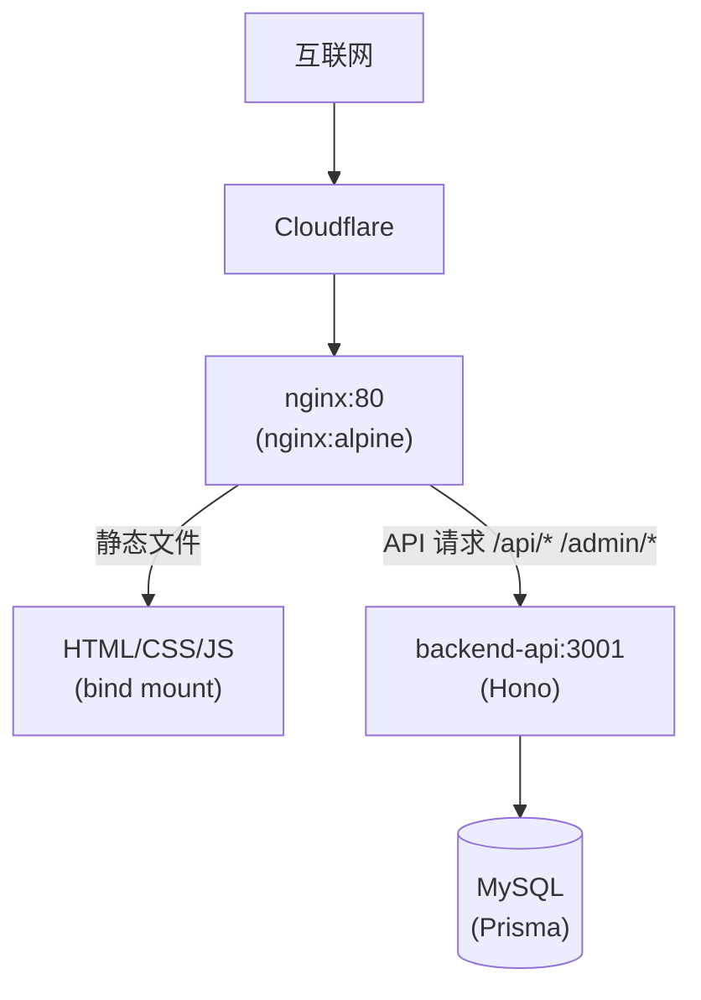

## 前置条件

服务器上 Docker 已安装，目录结构已规划好，MySQL 以容器形式运行在 `database_default` 网络中。如果还没完成这些步骤，请先阅读上一篇。

## 整体容器架构

先看一张逻辑图，理解两个容器和两个网络之间的关系：



两个容器的分工很明确：nginx 负责对外——接收用户请求，直接返回静态 HTML，或者把 API 请求转发给后端；backend-api 负责对内——处理数据逻辑，不直接暴露给互联网。

两个网络的隔离也是有意的：nginx 两只脚分别踩在 `internet` 和 `database_default` 上，所以它能和 backend-api 通信。但 backend-api 只在 `database_default` 中，外部请求必须经过 nginx 才能到达它。

## docker-compose.yml 逐行拆解

```yaml
services:
  backend-api:
    build:
      context: ./backend-api        # 构建上下文是 backend-api 目录
    image: je1ght-backend-api:latest # 构建后的镜像名
    container_name: je1ght-backend-api
    restart: unless-stopped         # 崩溃自动重启，手动 stop 不重启
    env_file:
      - .env                        # 从 .env 文件加载环境变量
    volumes:
      - /home/je1ght/websites/je1ght-platform/portal-source:/portal-source:rw
    networks:
      - database_default            # 和 MySQL 共享的内部网络
      - internet                    # 和 nginx 通信的 bridge

  nginx:
    image: nginx:alpine             # 直接用官方镜像，不需要 build
    container_name: je1ght-nginx
    restart: unless-stopped
    ports:
      - "80:80"                     # 宿主机 80 → 容器 80
    volumes:
      - ./nginx/default.conf:/etc/nginx/conf.d/default.conf:ro  # 配置只读
      - /home/je1ght/websites/je1ght-platform/portal-source/public:/usr/share/nginx/html:ro
    networks:
      - database_default
      - internet
    depends_on:
      - backend-api                 # 启动顺序：先 backend-api 再 nginx

networks:
  database_default:
    external: true                  # 使用外部已有网络（MySQL 所在的网络）
  internet:
    driver: bridge                  # 自动创建的新网络
```

几个容易忽略的细节：

**`restart: unless-stopped`**：和 `always` 的区别是——手动 `docker stop` 后再重启 Docker 守护进程，它不会自动启动。而 `always` 无论如何都会拉起来。对于生产环境，`unless-stopped` 更合理：主动想停能停掉，意外崩溃自己能起来。

**`depends_on`**：它只控制启动顺序，不等容器内的服务就绪。backend-api 可能还没连上 MySQL 就收到了 nginx 转发的请求。真正的健康检查需要在应用层处理——Hono 启动时等待数据库连接成功再开始监听。

**三个 volumes 挂载**：

- 第一个 bind mount（`:rw` 读写）让 backend-api 容器能直接修改 Hexo 源文件——重建时写入 Markdown、修改 YAML 数据文件、执行 `hexo generate`
- 第二个 bind mount（`:ro` 只读）让 nginx 能读取构建好的 HTML
- 第三个 mount（`:ro` 只读）注入 nginx 配置文件

`rw` 和 `ro` 的区分很重要——nginx 只需要读 HTML，不小心被容器内进程写入了才会出问题。

## nginx 路由规则

```nginx
server {
    listen 80;
    server_name _;

    root /usr/share/nginx/html;
    index index.html;

    # 后端 API — 所有 /api/ 请求转发给 Hono
    location /api/ {
        proxy_pass http://backend-api:3001/;
        proxy_http_version 1.1;
        proxy_set_header Host $host;
        proxy_set_header X-Real-IP $remote_addr;
        proxy_set_header X-Forwarded-For $proxy_add_x_forwarded_for;
        proxy_set_header X-Forwarded-Proto $scheme;
    }

    # 管理后台
    location /admin/ {
        rewrite ^/admin/$ /admin/index.html break;
        proxy_pass http://backend-api:3001;
        proxy_http_version 1.1;
        proxy_set_header Host $host;
    }

    # 认证接口
    location /auth/ {
        proxy_pass http://backend-api:3001/auth/;
        proxy_http_version 1.1;
        proxy_set_header Host $host;
    }

    # 静态文件 — 剩下的全部走 try_files
    location / {
        try_files $uri $uri/ /index.html;
    }

    # gzip 压缩 — 减少传输量
    gzip on;
    gzip_types text/plain text/css application/json application/javascript text/xml;
    gzip_min_length 1000;
}
```

路由匹配遵循 nginx 的优先级规则：精确匹配 > 前缀匹配。`location /api/` 的优先级比 `location /` 高，所以 `/api/posts` 会被转发到后端而不是尝试找静态文件。

`proxy_pass http://backend-api:3001/` 中的 `backend-api` 是 Docker 容器名。Docker 的内部 DNS 会自动把容器名解析为容器的内部 IP——只要它们共享同一个 Docker 网络。这就是为什么要让 nginx 和 backend-api 都加入 `database_default` 网络。

`try_files` 是单页应用的经典配置：先尝试直接匹配文件（`$uri`），然后尝试目录（`$uri/`），都找不到就回退到 `index.html`。对于 Hexo 生成的静态网站这足够了——每个页面对应一个真实的 HTML 文件或目录下的 `index.html`。

注意末尾的 `/` —— `proxy_pass http://backend-api:3001/` 中的 `/`。有它和没它的区别：

```text
请求: /api/posts
proxy_pass http://backend-api:3001/   → 转发到 /posts  (去掉 /api 前缀)
proxy_pass http://backend-api:3001    → 转发到 /api/posts (保留前缀)
```

这里用了带 `/` 的写法，意味着 `/api/posts` → Hono 收到的路径是 `/posts`。Hono 路由不需要写 `/api` 前缀，职责更清晰。

## 代理头的重要性

`proxy_set_header` 这几行不是装饰品：

```nginx
proxy_set_header Host $host;
proxy_set_header X-Real-IP $remote_addr;
proxy_set_header X-Forwarded-For $proxy_add_x_forwarded_for;
proxy_set_header X-Forwarded-Proto $scheme;
```

- `Host` — 告诉后端原始请求的域名，Hono 需要知道它来判断请求来源
- `X-Real-IP` — 用户真实 IP。不设的话后端只能看到 nginx 容器的 IP
- `X-Forwarded-For` — 代理链。经过多层代理时，每一层追加一个 IP
- `X-Forwarded-Proto` — 原始协议（http/https）。后面配 SSL 时很重要

缺少这些 header，后端日志里所有请求的来源 IP 都会是同一个容器内网地址，排查问题无从下手。

## Backend API 的 Dockerfile

```dockerfile
FROM node:24-alpine

WORKDIR /app

# 安装 hexo-cli 用于重建功能
RUN npm install -g hexo-cli

# 先复制依赖文件、安装，再复制源码
COPY package.json package-lock.json ./
RUN npm ci --omit=dev

COPY src/ ./src/
COPY prisma/ ./prisma/
COPY public/ ./public/
COPY scripts/ ./scripts/

RUN npx prisma generate

EXPOSE 3001

CMD ["node", "src/index.js"]
```

分层复制的顺序是有原因的：Docker 按行缓存构建层。如果 `COPY package.json` 这一层没变，Docker 会复用缓存跳过 `npm ci`。如果把 `COPY src/` 放在前面，每改一行代码都会让 `npm ci` 的缓存失效，每次都要重新安装——浪费时间。

`npm ci --omit=dev` 只安装生产依赖，`prisma` 作为 devDependency 不会被安装。但 Prisma Client（`@prisma/client`）是生产依赖，已经在 `node_modules` 中了。`prisma generate` 需要 devDependency 中的 `prisma` CLI——这里单独 `RUN npx prisma generate` 用 npx 从缓存中调用。

## 容器如何访问 Hexo 源文件

看 docker-compose 中的 volume 配置：

```yaml
volumes:
  - /home/je1ght/websites/je1ght-platform/portal-source:/portal-source:rw
```

服务器上的 `portal-source` 目录被挂载到容器内的 `/portal-source`。backend-api 的 rebuild 服务通过 `env.REPO_ROOT` 找到这个路径：

```javascript
function getPortalRoot() {
  if (env.REPO_ROOT === '/portal-source') return '/portal-source'
  // 本地开发时走另一个路径
  if (env.REPO_ROOT) return join(env.REPO_ROOT, 'apps', 'blog-portal')
}
```

当用户在管理后台点击"重建"，backend-api 容器内的代码会：

1. 从 MySQL 读取文章
2. 在 `/portal-source/source/_posts/` 下写入 Markdown 文件
3. 在 `/portal-source/source/_data/` 下写入 YAML 数据文件
4. 执行 `hexo generate`（容器内装了 hexo-cli）
5. 生成的 HTML 写到 `/portal-source/public/`

因为 `/portal-source` 是宿主机目录的 bind mount，写在容器内的文件在宿主机上直接可见。另一边 nginx 也在读同一个目录（`:ro`），所以新生成的 HTML 立刻就能对外服务。

## Hono 后端框架

Hono 是个轻量的 Node.js Web 框架，跟 Express 差不多但比较新——原生支持 async/await、TypeScript 类型推导、Edge Runtime。选 Hono 没选 Express 的原因也没啥特别的：

- 包更小，启动更快
- 自带 Zod 参数验证
- 路由写起来更顺手

一个典型的 API 路由长这样：

```javascript
import { Hono } from 'hono'

const app = new Hono()

app.get('/health', (c) => c.json({ status: 'ok' }))

app.post('/auth/login', async (c) => {
  const { email, password } = await c.req.json()
  // ... 验证逻辑
  return c.json({ success: true })
})
```

Session 用数据库存储（MySQL），通过 HttpOnly cookie 传递，没用 JWT。单管理员场景下服务端 session 比 JWT 省事——随时撤销，不用靠客户端删 token。

## 小结

服务器上现在跑着两个 Docker 容器：nginx 管 HTTP 请求，backend-api 管业务逻辑。内部网络通信，nginx 是唯一对外入口。后端能直接读写 Hexo 源文件、构建 HTML、然后 nginx 立即生效。

下一篇讲怎么接公网——买域名、配 Cloudflare、DNS 解析和 SSL/TLS 证书。