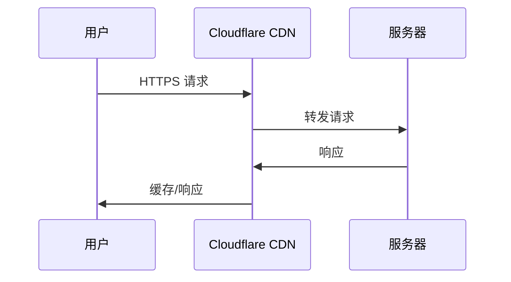

## 前置条件

服务器上 nginx 已能响应 HTTP 请求（用 `curl http://<服务器IP>` 测试应该能看到 Hexo 首页）。如果没有，请先完成上一篇的容器部署。

## 域名购买

域名注册商很多：Namecheap、Cloudflare、Google Domains（已卖给 Squarespace）、阿里云、腾讯云。

在哪个平台买不重要——域名的实际解析由 Nameserver 控制，和注册商可以不同。我的选择是在 Namecheap 购买，然后把 Nameserver 指向 Cloudflare。这样做的好处是：

- Namecheap 价格合理，首年折扣低
- Cloudflare 免费提供 DNS 解析、CDN、DDoS 防护、SSL 证书
- 两者解耦——以后想换注册商不影响 DNS 配置

购买流程很简单：搜索 → 加购物车 → 付款。选 `.com` 还是 `.top` 这类新顶级域名看个人喜好。`.com` 更贵但更权威，`.top` 便宜但某些邮件服务可能误判为垃圾邮件。我的 `je1ght.top` 主要因为——便宜且短。

## 将 Nameserver 指向 Cloudflare

这是关键的一步。Nameserver 告诉全球 DNS 系统"这个域名的解析权在谁手里"。

1. 注册 Cloudflare 账号
2. 在 Cloudflare Dashboard 中点击 "Add a site"，输入域名
3. Cloudflare 扫描现有 DNS 记录
4. 选一个 Plan（个人网站用 Free 完全够）
5. Cloudflare 分配两个 Nameserver 地址，类似 `alice.ns.cloudflare.com` 和 `bob.ns.cloudflare.com`
6. 回到域名注册商后台，把 Nameserver 改为 Cloudflare 分配的这两个地址

Nameserver 变更需要全球 DNS 传播，通常 1-24 小时生效。这段时间内部分用户可能解析到旧地址、部分解析到新地址。Cloudflare 会监控传播进度。

**为什么用 Cloudflare 而不是注册商自带的 DNS？**

注册商自带的 DNS 功能一般很简陋——只有基本 A 记录和 CNAME。Cloudflare 免费 DNS 附送 CDN 缓存、DDoS 防护、自动 SSL、Page Rules、Analytics。自己搭这些东西费时间效果还差，直接用 Cloudflare 就行。

## DNS 记录配置

Nameserver 生效后，在 Cloudflare DNS 面板中添加记录：

| 类型 | 名称 | 内容 | 代理状态 |
|------|------|------|----------|
| A | `je1ght.top` | `<服务器 IP>` | Proxied（橙色云朵）|
| CNAME | `www` | `je1ght.top` | Proxied |
| CNAME | `study` | `je1ght.top` | Proxied（另一个子域名）|

几条记录的作用：

- **A 记录 `@`**：把根域名 `je1ght.top` 指向服务器 IP。这是最核心的记录。
- **CNAME `www`**：`www.je1ght.top` → `je1ght.top`。CNAME 就是"别名"——请求 `www.je1ght.top` 等价于请求 `je1ght.top`。不用 A 记录的原因很简单：万一服务器 IP 变了，只需要改一条 A 记录，所有 CNAME 自动跟随。
- **CNAME `study`**：子域名 `study.je1ght.top` 指向同一个服务器。后面 nginx 可以根据 `Host` header 区分请求来源做不同的路由。

**代理状态（Proxy Status）**：橙色云朵表示开启 Cloudflare 代理，灰色表示 DNS-only（直连）。

开启代理后的请求路径：



Cloudflare 站在用户和服务器之间，所以它能缓存内容、隐藏服务器真实 IP、防御 DDoS。代价是 Cloudflare 能看到所有明文流量——所以必须配 HTTPS。

## SSL/TLS 配置

SSL/TLS 加密模式在 Cloudflare 的 SSL/TLS 选项卡中设置。四个选项：

| 模式 | 用户 ↔ Cloudflare | Cloudflare ↔ 服务器 | 适用场景 |
|------|-------------------|---------------------|----------|
| Off | 无加密 | 无加密 | 永远不要选 |
| Flexible | HTTPS | HTTP | 服务器不支持 HTTPS 时用 |
| Full | HTTPS | HTTPS（不验证证书）| 服务器有自签名证书 |
| Full (Strict) | HTTPS | HTTPS（验证证书）| 服务器有有效 CA 证书 |

对于自托管服务器，**Full (Strict)** 是最安全的选择。但它要求服务器上有有效的 SSL 证书（不能是自签名的）。用 Cloudflare 的 **Origin CA Certificate** 可以免费获得：

1. 在 Cloudflare SSL/TLS → Origin Server 中生成证书
2. 下载 `.pem`（证书）和 `.key`（私钥）
3. 上传到服务器
4. 修改 nginx 配置监听 443 端口

另一种方案是用 Let's Encrypt + Certbot 自动续期。但 Origin CA Certificate 更简单——不需要在服务器上跑 certbot，15 年有效期不需要操心续期。

当前 `je1ght.top` 使用 nginx 只监听 80 端口，Cloudflare 端设为 **Full** 模式（用户到 Cloudflare 加密，Cloudflare 到服务器暂时走 HTTP）。这是一条待办事项——后续会升级到 Full (Strict)。

### Origin CA Certificate 配置方法（未来升级用）

在 nginx 配置中添加：

```nginx
server {
    listen 443 ssl;
    server_name je1ght.top;

    ssl_certificate     /etc/nginx/ssl/origin.pem;
    ssl_certificate_key /etc/nginx/ssl/origin.key;

    # ... 其余配置同上
}

# 把 HTTP 重定向到 HTTPS
server {
    listen 80;
    server_name je1ght.top;
    return 301 https://$host$request_uri;
}
```

然后把证书文件通过 volume 挂进 nginx 容器。

## CDN 缓存策略

Cloudflare 默认会缓存静态资源（CSS、JS、图片），但不会缓存 HTML。对于 Hexo 生成的网站，这个默认行为基本够了。有几个细节需要调整：

**Caching Level**（缓存级别）设为 **Standard**：只缓存带标准文件扩展名的资源。不需要缓存 `/api/` 和 `/admin/` 路径下的内容——这些是动态请求。

**Browser Cache TTL**：控制 Cloudflare 告诉浏览器缓存多久。静态站点可以设长一点（一个月），因为 Hexo 构建时文件名会变（加上 hash）。但这个项目用了 BUILD_VER 缓存爆破（后面部署篇讲），HTML 文件内容变了但文件名不变，所以 Browser Cache TTL 不宜太长——4 小时到 1 天是比较合理的范围。

**Page Rules** 可以用来做精细控制：

```text
je1ght.top/api/*    → Cache Level: Bypass        # 不缓存 API
je1ght.top/admin/*  → Cache Level: Bypass        # 不缓存管理后台
je1ght.top/postimage/* → Cache Level: Cache Everything  # 图片长期缓存
```

Page Rules 免费版有 3 条额度，按需使用。

## 中国大陆访问的考量

Cloudflare 的 CDN 节点在中国大陆没有部署（需要 ICP 备案才行）。这意味着国内用户访问时，流量只能走到最近的海外节点——通常是香港、日本或新加坡。

几个影响：

- 延迟会比有国内 CDN 的网站高（100-300ms vs 20-50ms），但对个人博客来说可以接受
- 某些 Cloudflare IP 可能被运营商 QoS 限速
- 国内 DNS 可能返回不是最优的 Cloudflare 边缘节点

不能做的事情：使用 Cloudflare 的 Workers、Pages 等需要在 Cloudflare IP 上跑的特性——这些 IP 在大陆访问不稳定。

可以做优化的事情：

- 开启 Cloudflare Argo Smart Routing（付费），让流量走 Cloudflare 的优化骨干网
- 减少页面体积——压缩图片、开启 gzip/brotli、减少 JS/CSS
- 把不常变的大文件（字体、图片）放在有国内 CDN 的对象存储上

对于个人博客来说，这些优化是锦上添花。Hexo 输出的纯静态页面本身就很小（几十 KB），加载速度在可接受范围内。

## 验证一切正常

部署完成后，用这些命令验证：

```bash
# DNS 解析是否指向 Cloudflare
dig je1ght.top
# 应该看到 Cloudflare 的 IP，不是服务器真实 IP

# HTTPS 是否正常工作
curl -I https://je1ght.top
# 应该返回 HTTP/2 200 或 HTTP/3 200

# 服务器直接 HTTP 是否可达（测试 nginx）
curl -I http://<服务器IP>
# 应该返回 200

# SSL 证书信息
curl -vI https://je1ght.top 2>&1 | grep issuer
# 应该看到 Cloudflare 颁发的证书
```

## 小结

现在 `https://je1ght.top` 全球都能访问了——DNS、HTTPS、CDN 全就位。Cloudflare 免费套餐对个人网站绰绰有余。

下一篇是整个系列的核心——`deploy.sh` 部署脚本逐行拆解，把本地文章推上服务器自动上线。