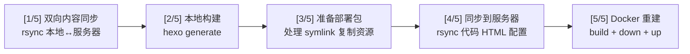

## 前置条件

前四篇搞完了：本地能 Hexo 构建，服务器上 Docker 容器正常运行，域名 + Cloudflare + HTTPS 也配好了。现在缺最后一步——把本地文章推上服务器。

## 为什么不是 GitHub Actions

正经做法是用 CI/CD——push 到 GitHub 触发 GitHub Actions 自动构建部署。但我这有几个特殊情况：

- 管理后台可以在线编辑文章，文章存储在 MySQL 里。这意味着服务器上的内容可能比本地更新——如果 CI 直接覆盖服务器文件，在线编辑的内容就丢了
- 服务器在墙内访问不稳定的网络环境中，GitHub Actions runner 未必能稳定 SSH 到服务器
- 我想保留对部署过程的完全控制——每一步都清楚发生了什么

所以选择了**本地执行部署脚本**的方式。按一个回车，`deploy.sh` 自动完成从本地构建到 Docker 重启的五步流程。这不是最"自动化"的做法，但适合单人的个人网站场景。

## 部署流程全景

`deploy.sh` 分为五个阶段，每阶段对应一个 `[N/5]` 标记：



## 第一阶段：双向内容同步

```bash
echo "[1/5] Bidirectional content sync..."
```

这是整个流程中逻辑最复杂的一步。为什么是"双向"？因为内容的来源有两个：本地 Markdown 文件和管理后台（MySQL）。

### 阶段 a：推送本地内容到服务器

```bash
rsync -avz \
  "$REPO_ROOT/apps/blog-portal/source/_posts/" \
  "$SERVER:$SERVER_PORTAL/source/_posts/"
rsync -avz \
  "$REPO_ROOT/apps/blog-portal/source/postimage/" \
  "$SERVER:$SERVER_PORTAL/source/postimage/"
```

`rsync -avz` 三个标志的含义：
- `-a`（archive）：保留文件属性（时间戳、权限、所有者），递归目录
- `-v`（verbose）：显示传输了哪些文件
- `-z`（compress）：传输时压缩，节省带宽

注意这里**没有 `--delete`**。这意味着如果服务器上有管理后台创建的文章，不会被删除。如果加了 `--delete`，服务器上 MySQL 生成的 Markdown 文件会被清空——灾难。

`2>&1 | tail -1` 把 rsync 的 stderr 合并到 stdout，只显示最后一行。rsync 的完整输出很长，只保留摘要——"sent 1.23M bytes received 45 bytes 845.12K bytes/sec"。

### 阶段 b：将本地文章导入 MySQL

```bash
ssh "$SERVER" "docker exec je1ght-backend-api node scripts/import-local-posts.js 2>&1" || true
```

这个脚本读取 `_posts/` 目录下的 Markdown 文件，把它们导入 MySQL 的 `BlogPost` 表。这样管理后台就能看到并编辑所有文章——包括本地创建的。

`|| true` 表示即使导入失败也不要中断整个部署。导入失败的原因通常是文章格式有问题或者数据库连接超时，不应该阻止部署。

`import-local-posts.js` 会跳过已经标记为 `<!-- managed-by-backend-api -->` 的文件——因为那是后台创建的，不要覆盖用户在后台编辑的内容。判断逻辑基于文件内容中的特殊标记，而非文件名或时间戳。

### 阶段 c：拉回服务器状态

```bash
rsync -avz \
  "$SERVER:$SERVER_PORTAL/source/_posts/" \
  "$REPO_ROOT/apps/blog-portal/source/_posts/"
rsync -avz \
  "$SERVER:$SERVER_PORTAL/source/postimage/" \
  "$REPO_ROOT/apps/blog-portal/source/postimage/"
rsync -avz \
  "$SERVER:$SERVER_PORTAL/source/_data/" \
  "$REPO_ROOT/apps/blog-portal/source/_data/"
```

这几行把服务器上的内容拉回本地。为什么需要回拉？

- 管理后台可能在服务器上创建或编辑了文章（存在 `_posts/` 中，由 `rebuild.js` 生成）
- 管理后台可能上传了图片到 `postimage/`
- 后台生成的 `site_profile.yml` 和 `portfolio.yml` 等数据文件存在 `_data/`

回拉确保本地仓库和服务器状态一致。下次写新文章时，本地已经有服务器上的最新内容。

最后拉回共享资源：

```bash
rsync -avz \
  "$SERVER:$SERVER_PORTAL/source/shared-assets/images/" \
  "$REPO_ROOT/packages/shared-assets/images/"
```

管理后台可以上传品牌资产——头像、图标、背景图。这些存在服务器的 `shared-assets/images/` 目录下。回拉后本地 `packages/shared-assets/images/` 和服务器同步。

### 为什么用 MySQL 作为中间层

这里可能有一个疑问：内容不就是 Markdown 文件吗，rsync 直接同步不就行了，干嘛还要 MySQL？

管理后台编辑文章时，操作的是数据库记录——标题、描述、标签、分类、正文，每个字段独立存储。如果直接编辑 Markdown 的 YAML frontmatter，就得自己解析 YAML 语法，处理转义、多行字符串、嵌套数组。用 Prisma 操作数据库记录可靠得多。

MySQL 的角色是"内容中转站"：本地文章 → MySQL → 后台编辑 → MySQL → 生成 Markdown → Hexo 构建。Markdown 文件是 Hexo 需要的形式，MySQL 是后台需要的存储形式。`import-local-posts.js` 和 `rebuild.js` 负责两个方向的转换。

## 第二阶段：本地构建

```bash
echo "[2/5] Building Portal..."
cd "$REPO_ROOT/apps/blog-portal"
rm -f db.json
./node_modules/.bin/hexo generate
```

`db.json` 是 Hexo 的内部缓存文件。**删除它是绝对必要的**。Hexo 用 `db.json` 缓存文章的解析结果——如果上次构建时有 5 篇文章，这次回拉后有 7 篇，Hexo 可能只重新解析 2 篇新增的而跳过已有的。但如果已有文章的内容在服务器上被修改过，Hexo 不会检测到，因为它只比较文件是否存在，不比较文件内容。删除 `db.json` 强制 Hexo 重新解析所有文章。

这里直接用 `./node_modules/.bin/hexo` 而不是全局的 `hexo` 命令。两个原因：一是确保用的是项目安装的版本（`npm install` 时固定了版本号），二是 CI/脚本环境中全局命令不一定可用。

### 缓存爆破

```bash
BUILD_VER=$(date +%s)
echo "       Cache-bust version: $BUILD_VER"
find "$REPO_ROOT/apps/blog-portal/public" -name '*.html' -exec sed -i '' "s/BUILD_VER/$BUILD_VER/g" {} +
```

这是解决 CDN 缓存的一个技巧。

HTML 模板中使用 `BUILD_VER` 作为占位符：

```html
<link rel="stylesheet" href="/css/style.css?v=BUILD_VER">
```

构建后，`BUILD_VER` 被替换为当前 Unix 时间戳。每次部署生成一个全新的版本号，Cloudflare 和浏览器就会认为这是新资源，不会使用旧缓存。

为什么要这样而不是用 Hexo 的文件名 hash？因为 Hexo 主题的资源引用不一定支持 hash。用 sed 全局替换是最粗暴但最可靠的方法。

## 第三阶段：准备部署包

```bash
echo "[3/5] Preparing portal for deployment..."
```

服务器上没有 `packages/` 目录——整个仓库结构只在本地存在。部署前需要把共享依赖打包进 portal：

```bash
# 保存 symlink 的目标路径，以便后面恢复
SHARED_ASSETS_REAL="$(cd "$PORTAL_DIR/source/shared-assets" 2>/dev/null && pwd -P || true)"

# 复制共享配置
cp "$REPO_ROOT/packages/shared-config/site-identity.json" "$PORTAL_DIR/"

# 替换 symlink 为真实目录
rm -rf "$PORTAL_DIR/source/shared-assets"
cp -r "$REPO_ROOT/packages/shared-assets" "$PORTAL_DIR/source/shared-assets"
```

本地开发时 `source/shared-assets` 是一个 symlink，指向 `packages/shared-assets/`。这样改一处两边生效。但 rsync 到服务器时，symlink 会变成一个失效的链接——服务器上没有 `packages/` 目录。所以在同步前要把 symlink 替换为真实的文件副本。

`pwd -P` 获取 symlink 的实际目标路径（而非 symlink 自身的路径），保存在变量中。部署完成后用这个变量恢复 symlink：

```bash
rm -rf "$PORTAL_DIR/source/shared-assets"
ln -s "$SHARED_ASSETS_REAL" "$PORTAL_DIR/source/shared-assets"
rm -f "$PORTAL_DIR/site-identity.json"
```

`site-identity.json` 也是同理——复制到 portal 目录后再清理。

## 第四阶段：同步到服务器

```bash
echo "[4/5] Syncing to server..."
```

三段 rsync，各有分工：

### 第一段：同步 portal 源码

```bash
rsync -avz --delete \
  --exclude='node_modules' \
  --exclude='.git' \
  --exclude='public' \
  "$PORTAL_DIR/" \
  "$SERVER:$SERVER_PORTAL/"
```

这行把整个 portal 目录同步到服务器。排除项的含义：

- `node_modules` — 太大了，服务器上单独 `npm install`
- `.git` — 不需要 .git 历史在服务器上
- `public` — 下一步单独同步

**这里有 `--delete`**——和第一阶段不同。这里 `--delete` 是正确的：服务器上的 Hexo 文件应该是本地文件的精确副本。如果本地删除了某个脚本，服务器上也应该删除。

### 第二段：同步构建产物

```bash
rsync -avz --delete \
  "$PORTAL_DIR/public/" \
  "$SERVER:$SERVER_PORTAL/public/"
```

构建好的 HTML 单独同步。也用 `--delete`——上一版构建可能产生了一些旧页面（比如删了一篇文章），服务器上不应该保留。

### 第三段：同步后端源码

```bash
rsync -avz --delete \
  --exclude='node_modules' \
  --exclude='.env' \
  "$REPO_ROOT/apps/backend-api/" \
  "$SERVER:$SERVER_DOCKER/backend-api/"
```

同步 backend-api 源码到 Docker 构建用的目录（`~/docker/je1ght-platform/backend-api/`）。排除 `.env` 至关重要——`.env` 包含数据库密码和 admin 凭证，**永远不能**被 rsync 覆盖。服务器上的 `.env` 是手工创建并独立维护的。

## 第五阶段：Docker 重建

```bash
echo "[5/5] Installing deps & rebuilding Docker..."
```

### 安装依赖

```bash
ssh "$SERVER" "cd $SERVER_PORTAL && npm install --silent 2>&1 | tail -1"
```

服务器上的 `node_modules` 可能和本地不同——操作系统不同（macOS vs Linux），某些 native module 需要重新编译。而且 Hexo 插件在服务器上也需要可用。

### 同步基础设施配置

```bash
rsync -avz "$REPO_ROOT/infra/docker-compose.yml" "$SERVER:$SERVER_DOCKER/"
rsync -avz "$REPO_ROOT/infra/nginx/default.conf" "$SERVER:$SERVER_DOCKER/nginx/"
```

nginx 配置变更也需要同步。如果修改了路由规则或添加了新的代理路径，这两行确保服务器上的配置是最新的。

### 首页 generator

`portal-home-generator.js` 是自定义首页的核心——它用 `hexo.extend.generator.register` 抢占 `index.html` 路由，压过 Hexo 内置的 `hexo-generator-index`。第一篇里讲过，首页不能靠 `source/index.md` 控制，必须用 generator 劫持。这个文件部署时正常同步过去就行，不用做任何特殊处理。

### 修复文件权限

```bash
ssh "$SERVER" "docker exec je1ght-backend-api chown -R 1000:1000 /portal-source/public/ 2>/dev/null" || true
```

这是踩坑踩出来的。Docker 容器内 `hexo generate` 以 root 运行（默认），生成的文件所有者是 root。但 nginx 容器以 `nginx` 用户运行，对 root 所有的文件只有读权限——有时候连读权限都没有（取决于 umask）。执行 `chown -R 1000:1000` 把文件所有者改回 node 用户（Alpine 中 node 用户的 UID 是 1000），nginx 就能正常读取了。

### 重建并重启

```bash
ssh "$SERVER" "cd $SERVER_DOCKER && docker compose build backend-api 2>&1 | tail -3 && docker compose down 2>&1 | tail -1 && docker compose up -d 2>&1 | tail -1"
```

三个命令串联：

1. `docker compose build backend-api` — 重新构建后端镜像（只 build backend-api，nginx 用官方镜像不需要 build）
2. `docker compose down` — 停止并删除所有容器
3. `docker compose up -d` — 后台启动所有容器

为什么是 `down` + `up` 而不是 `restart`？因为 `restart` 不会重新创建容器——如果 Dockerfile 或配置变了，旧容器不感知这些变化。`down` + `up` 确保容器以最新镜像和配置重新创建。

为什么不是 `up -d --force-recreate`？因为 `down` 会清理旧容器和网络连接，状态更干净。

### 同步管理员凭证

```bash
"$REPO_ROOT/scripts/sync-admin.sh" 2>/dev/null || true
```

最后把本地的 admin 邮箱和密码同步到服务器。`sync-admin.sh` 做两件事：更新服务器 `.env` 文件中的 `ADMIN_EMAIL` 和 `ADMIN_PASSWORD`，然后直接更新 MySQL 中 `AdminUser` 表的密码哈希。密码用 `bcryptjs` 哈希（cost factor 12）后存储，不存明文。

## 管理后台的重建按钮 — rebuild.js

除了 `deploy.sh`，还有一个触发构建的入口：管理后台的"重建"按钮。它的后端逻辑在 `apps/backend-api/src/services/rebuild.js` 中。

两个入口的区别：

| | deploy.sh | rebuild.js |
|---|---|---|
| 触发方式 | 本地命令行 | 管理后台按钮 / API 调用 |
| 内容来源 | 本地文件 + 服务器文件 | MySQL 数据库 |
| 执行环境 | 本地 macOS | Docker 容器内 |
| 频率 | 推送新文章时 | 后台编辑内容后 |

`rebuild.js` 的核心逻辑：

```javascript
// 1. 从 MySQL 读取已发布文章
const posts = await prisma.blogPost.findMany({
  where: { published: true },
})

// 2. 每篇文章生成一个 Markdown 文件，带 frontmatter
for (const post of posts) {
  const filename = `${post.slug}.md`
  const content = postToFrontmatter(post) + '\n' + '<!-- managed-by-backend-api -->'
  await writeFile(join(postsDir, filename), content, 'utf-8')
}

// 3. 生成 site_profile.yml、portfolio.yml

// 4. 在容器内执行 hexo generate
await execFileAsync(hexoBin, ['generate'], { cwd: portalRoot })
```

生成的文件带上 `<!-- managed-by-backend-api -->` 标记。这个标记有两个作用：

- `import-local-posts.js` 在导入时跳过这些文件——它们本来就是从数据库生成的，不需要导回数据库
- `rebuild.js` 在下次重建时通过 `clearManagedFiles()` 清除所有带标记的文件再重新生成，避免旧文章残留

注意 `rebuild.js` **绝不使用 `hexo clean`**。`hexo clean` 会删除 `public/` 目录，而 `public/` 是 Docker bind mount 的挂载点。删除挂载点会导致 bind mount 断裂——nginx 容器再也看不到新生成的 HTML。解决办法只在 `db.json` 层面清理缓存，不动 `public/`。

重建完成后执行 `chown -R 1000:1000` 修复权限，然后 `touch public/.nginx-refresh` 触发 nginx 重新读取文件。

## 常见踩坑合集

### 坑 1：hexo clean 破坏 bind mount

**症状**：部署后网站 404，nginx 日志显示 "No such file or directory"。

**原因**：Docker bind mount 在容器启动时建立了一个指向宿主机路径的链接。如果宿主机上的目录被删除再重建，bind mount 会断裂——容器内的路径指向了旧的（已失效的）inode。`hexo clean` 会 `rm -rf public/` 再 `mkdir public/`，恰好触发这个问题。

**解决**：永远不在服务器上执行 `hexo clean`。重建时只删除 `db.json`。

### 坑 2：db.json 缓存导致内容不更新

**症状**：文章修改了但网站显示旧内容。

**原因**：Hexo 的 `db.json` 缓存了文章解析结果。如果内容通过 rsync 更新而非 Hexo 自身感知（比如服务器上 rebuild.js 写入的新 Markdown），缓存不会自动失效。

**解决**：每次构建前 `rm -f db.json`。`deploy.sh` 和 `rebuild.js` 都这样做了。

### 坑 3：root 权限导致 nginx 403

**症状**：nginx 返回 403 Forbidden。

**原因**：Docker 容器内默认以 root 运行，`hexo generate` 生成的 `public/` 文件所有者为 root。nginx 容器内的 nginx 进程是普通用户，无法读取属于 root 且权限为 `700` 的文件。

**解决**：构建后执行 `chown -R 1000:1000 public/`。1000 是 Alpine Linux 中 node 用户的 UID。

### 坑 4：.disabled 后缀根本禁不掉 Hexo 脚本

**症状**：把脚本重命名为 `.js.disabled`，以为它不会被加载了，结果还是跑了。

**原因**：Hexo 的脚本加载器会 `require()` `scripts/` 目录下根层级的所有文件，不关心扩展名。`portal-home-generator.js.disabled` 仍然会被 Node 的 `require()` 当成 JS 模块加载。

**解决**：把想禁用的脚本移到 `scripts/_disabled/` 子目录里。Hexo 不会递归扫描子目录。或者直接删掉。

### 坑 5：双端文章不同步

**症状**：本地写了一篇文章部署后消失了，或者服务器编辑的文章被部署覆盖。

**原因**：`deploy.sh` 的 rsync 方向理解有误。第一阶段推-拉-回的三段式设计确保了双端内容合并，但如果跳过某一步就会丢数据。

**解决**：理解 `deploy.sh` 的同步逻辑——先推本地新内容到服务器，导入 MySQL，再拉回服务器上的全部内容。顺序不能乱。

## 小结

五篇文章，从本地 Hexo 到全球可访问。整条链路回顾一下：

本地写 Markdown → hexo generate → rsync 双向同步 → deploy.sh 打包推送 → Docker 重建 → nginx 读到新 HTML → Cloudflare CDN 分发 → 用户浏览器。

搭个人网站其实就是在摸互联网基础设施是怎么串起来的——DNS、TCP/IP、HTTP、TLS、容器、CDN。每个字节怎么到的用户屏幕上，现在心里都清楚了。