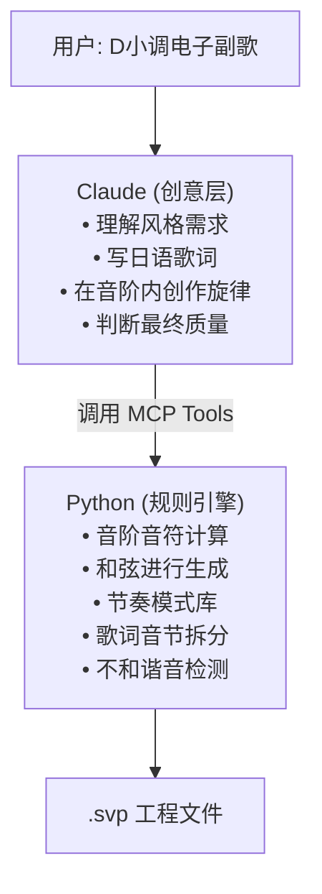

## 目标

让 AI 从自然语言描述自动生成完整的音乐工程：

> "D 小调电子风格副歌，4 小节，Kasane Teto"

AI 应该自动决定旋律、分配歌词、安排节奏、写入 SVP。

## 架构：Hybrid（Claude 创意 + Python 规则）



**分工原则**：Claude 做创意判断，Python 做规则保证。你不需要懂乐理——Python 帮你管住音阶、和弦、节奏。

## 音阶系统

7 种音阶类型：

| 类型                | 情绪               | 适用风格                 |
| ------------------- | ------------------ | ------------------------ |
| `major`             | 明亮、快乐         | pop, rock, ballad        |
| `natural_minor`     | 悲伤、深情         | jpop, ballad, electronic |
| `harmonic_minor`    | 古典、异域感       | classical, electronic    |
| `major_pentatonic`  | 民谣、纯朴         | pop, ballad, jpop        |
| `minor_pentatonic`  | 蓝调、摇滚         | rock, electronic         |
| `japanese_insen`    | 和风、禅意         | electronic, jpop         |
| `japanese_yonanuki` | J-pop 经典、青春感 | jpop, electronic         |

使用：`get_scale("D", "natural_minor")` → `[D4, E4, F4, G4, A4, A#4, C5]`

## 和弦引擎

4 种风格的和弦进行模板：

| 风格       | 示例进行                    |
| ---------- | --------------------------- |
| jpop       | `IV-V-iii-vi`, `vi-IV-I-V`  |
| electronic | `i-VI-III-VII`, `i-VI-iv-V` |
| ballad     | `I-V-vi-IV`, `vi-V-IV-iii`  |
| rock       | `I-IV-V`, `i-VI-VII`        |

使用：`suggest_chords("D", "electronic", 4)` → `Dm → Am → A# → Gm`

## 节奏模式库

预设节奏型按风格分类，自动适配小节数。

使用：`get_rhythm_durations("electronic", 4)` → `[0.5, 0.5, 0.5, ...]`（27 个音符，总计 16 拍）

## 歌词拆分

日语罗马字自动拆分为音节：

```
"kimitomitanatsunosora"
  → ["ki", "mi", "to", "mi", "ta", "na", "tsu", "no", "so", "ra"]
```

每个音节对应一个音符。

## 完整工作流

```python
# Step 1: 音阶
notes = get_scale("D", "natural_minor")
# → [D4, E4, F4, G4, A4, A#4, C5]

# Step 2: 和弦
chords = suggest_chord_progression("D", "electronic", 4)
# → Dm → Am → A# → Gm

# Step 3: 节奏
durations = get_rhythm_durations("electronic", 4)
# → [0.5, 0.5, 0.5, ...] × 27 notes

# Step 4: Claude 创作旋律 + 歌词
melody = [62, 67, 69, 70, 69, 67, 65, 62, ...]
lyrics = split_lyrics("kimitomitanatsunosora")
# → ["ki", "mi", "to", "mi", "ta", ...]

# Step 5: 音阶约束检查
bad = [p for p in melody if p not in notes]  # → []

# Step 6: 写入 SVP
for dur, pitch, syl in zip(durations, melody, lyrics):
    add_note_to_svp(path, onset, dur, pitch, syl)
```

## MCP Tools 全貌（14 个）

| #   | Tool                      | Phase | 功能       |
| --- | ------------------------- | ----- | ---------- |
| 1   | `hello`                   | 1     | 问候语     |
| 2   | `add`                     | 1     | 加法       |
| 3   | `read_file`               | 1     | 读文件     |
| 4   | `create_svp_project`      | 3     | 新建工程   |
| 5   | `inspect_svp_project`     | 3     | 分析工程   |
| 6   | `list_svp_notes`          | 3     | 列出音符   |
| 7   | `add_note_to_svp`         | 3     | 添加音符   |
| 8   | `set_svp_render_filename` | 3     | 设置导出名 |
| 9   | `midi_info`               | 3     | 音高对照   |
| 10  | `get_musical_scale`       | 4     | 音阶查询   |
| 11  | `suggest_chords_for_key`  | 4     | 和弦推荐   |
| 12  | `get_rhythm_for_style`    | 4     | 节奏获取   |
| 13  | `split_japanese_lyrics`   | 4     | 歌词拆分   |
| 14  | `plan_composition`        | 4     | 作曲计划   |

## 测试方式

重启 Claude Code（加载 `.mcp.json`），在新会话中输入：

> "用 plan_composition 帮我规划一首 D 小调 electronic 风格的 4 小节乐段"

如果工具被正确加载，Claude 会调用 `plan_composition` 并返回完整的作曲参数。

---

> **Synthesizer V MCP 开发系列**（共 4 篇）
>
> 上一篇：
<!-- managed-by-backend-api -->