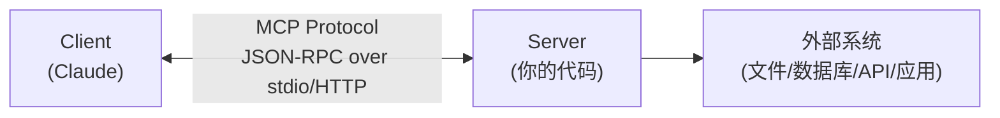
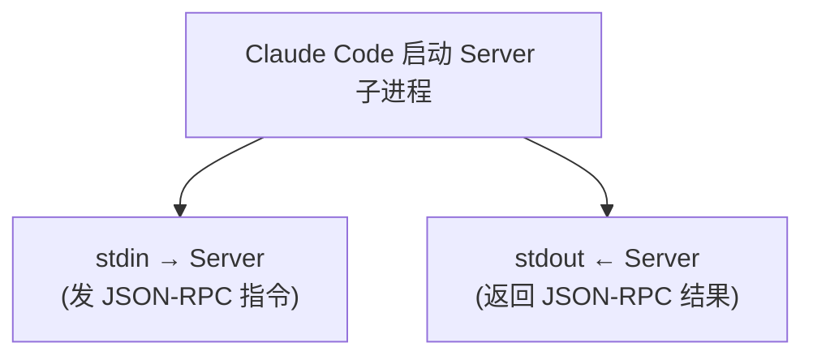

## MCP 是什么

**MCP（Model Context Protocol）** 是 Anthropic 推出的开放协议，解决的核心问题是：

> AI 模型只能"说话"，如何让它"做事"？

MCP 让 AI（如 Claude）可以**发现和调用外部工具**——读文件、查数据库、操作应用、控制设备。

类比：MCP 之于 AI，如同 USB 之于外设——一个通用接口标准。

## 核心概念

### 三个角色



- **Client（客户端）**：AI 模型这边。发起工具调用请求。
- **Server（服务端）**：你写的代码。声明能力、执行操作。
- **Transport（传输层）**：两者之间怎么通信。最常用是 **stdio**（标准输入输出）。

### stdio 通信

MCP Server 不是 HTTP 服务器——不需要端口，不需要 URL。



Server 的 `print()` / `logging` 必须走 **stderr**，因为 **stdout 被 JSON-RPC 协议独占**。

### Tool（工具）是什么

Tool 是 MCP 最核心的概念。一个 Tool 就是**一个函数**，附带详细的类型声明。

AI 看到的 Tool Schema：

```json
{
  "name": "add",
  "description": "计算两个整数的和",
  "inputSchema": {
    "type": "object",
    "properties": {
      "a": { "type": "integer", "description": "第一个加数" },
      "b": { "type": "integer", "description": "第二个加数" }
    },
    "required": ["a", "b"]
  }
}
```

有了 Schema，AI 就知道：
- 这个工具叫什么（`add`）
- 它做什么（"计算两个整数的和"）
- 需要什么参数（`a` 是整数，`b` 是整数）
- 哪些参数必须传（`a` 和 `b` 都必填）

## AI 调用工具的全流程

### Step 1：Server 启动 → 注册能力

```
Server stdout → Client:
{
  "jsonrpc": "2.0",
  "method": "tools/list",
  "result": {
    "tools": [
      { "name": "hello", ... },
      { "name": "add", ... },
      { "name": "read_file", ... }
    ]
  }
}
```

### Step 2：用户提问 → AI 推理

用户说：**"帮我算一下 123 + 456"**

AI 内部推理链：
1. 用户要做加法
2. 有一个 `add` 工具可以做加法
3. 需要 `a` 和 `b` 两个参数
4. a=123, b=456
5. 调用 `add(a=123, b=456)`

### Step 3：Client 发送调用指令

```
Client stdin → Server:
{
  "jsonrpc": "2.0",
  "method": "tools/call",
  "params": {
    "name": "add",
    "arguments": { "a": 123, "b": 456 }
  }
}
```

### Step 4：Server 执行 → 返回

```python
def add(a: int, b: int) -> int:
    return a + b  # → 579
```

```
Server stdout → Client:
{
  "jsonrpc": "2.0",
  "result": {
    "content": [{ "type": "text", "text": "579" }]
  }
}
```

### Step 5：AI 整合答案

AI 拿到 579，返回给用户："123 + 456 = 579"

## 实战代码

### 项目结构

```
Synthesizer-V-MCP/
├── .mcp.json                   ← Claude Code 自动发现配置
├── pyproject.toml              ← Python 项目配置
└── src/synthv_mcp/
    ├── __init__.py
    └── server.py               ← MCP Server 主文件
```

### pyproject.toml

```toml
[project]
name = "synthv-mcp"
version = "0.1.0"
requires-python = ">=3.12"
dependencies = [
    "mcp[cli]>=1.0.0",
]

[build-system]
requires = ["hatchling"]
build-backend = "hatchling.build"
```

关键依赖：`mcp[cli]` 是 MCP 官方 Python SDK，带 CLI 工具（`mcp dev` / `mcp install`）。

### server.py —— 核心代码

```python
from pathlib import Path
from mcp.server.fastmcp import FastMCP

# 创建 Server 实例
# "synthv-mcp" 是 Server 名称，Claude 用它来标识这个 Server
mcp = FastMCP("synthv-mcp")


@mcp.tool()
def hello(name: str) -> str:
    """返回一个个性化的问候语。"""
    return f"Hello, {name}!"


@mcp.tool()
def add(a: int, b: int) -> int:
    """计算两个整数的和。"""
    return a + b


@mcp.tool()
def read_file(path: str) -> str:
    """读取并返回文本文件的内容。"""
    p = Path(path).expanduser()
    if not p.exists():
        return f"[错误] 文件不存在: {path}"
    if p.is_dir():
        return f"[错误] 路径是目录而非文件: {path}"
    return p.read_text(encoding="utf-8")


if __name__ == "__main__":
    mcp.run(transport="stdio")
```

### 代码解读

**`@mcp.tool()` 装饰器的魔法**

| Python 代码                    | AI 看到的 Schema              |
| ------------------------------ | ----------------------------- |
| `def hello(name: str) -> str:` | `"name"` 参数类型是 `string`  |
| `"""返回问候语。"""`           | `description: "返回问候语。"` |
| `-> str`                       | 返回值类型是 `string`         |

FastMCP **自动**把 Python 类型标注（type hints）翻译为 JSON Schema，不需要手写任何 JSON。

**`mcp.run(transport="stdio")`**

- `stdio` 表示通过标准输入/输出通信
- Server 启动后阻塞在 `run()`，等待 stdin 指令
- 每个指令是一个 JSON-RPC 消息

### 配置文件 .mcp.json

```json
{
  "mcpServers": {
    "synthv-mcp": {
      "command": "uv",
      "args": [
        "run",
        "--directory",
        "/path/to/Synthesizer-V-MCP",
        "python",
        "src/synthv_mcp/server.py"
      ]
    }
  }
}
```

Claude Code 启动时会：
1. 扫描项目根目录的 `.mcp.json`
2. 对每个 server 执行 `command + args` 作为子进程
3. 通过 stdio 完成握手和工具发现

## 核心知识点清单

- [x] **MCP 是什么**：AI 调用外部工具的开放协议
- [x] **Client-Server 模型**：Claude 是 Client，你的代码是 Server
- [x] **stdio 传输**：通过标准输入/输出通信，不需要 HTTP
- [x] **JSON-RPC**：所有消息都是 JSON 格式
- [x] **Tool Schema**：声明工具名、描述、参数类型、是否必填
- [x] **FastMCP**：官方 SDK 的高级封装，装饰器自动生成 Schema
- [x] **type hints → Schema**：Python 类型标注自动翻译为 JSON Schema
- [x] **docstring → description**：函数文档字符串自动成为工具描述
- [x] **.mcp.json**：Claude Code 的项目级 MCP 配置文件
- [x] **stderr vs stdout**：Server 日志走 stderr，stdout 被协议独占

## 下一步

Phase 2：研究 `.svp` 工程文件格式，让 AI 能读写 SynthV 工程。

---

> **Synthesizer V MCP 开发系列**（共 4 篇）
>
> 下一篇：
<!-- managed-by-backend-api -->